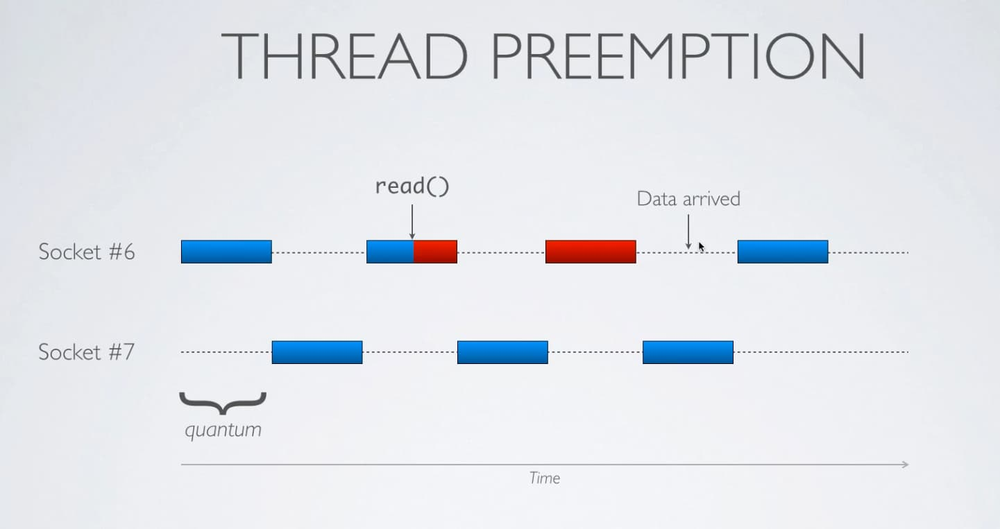
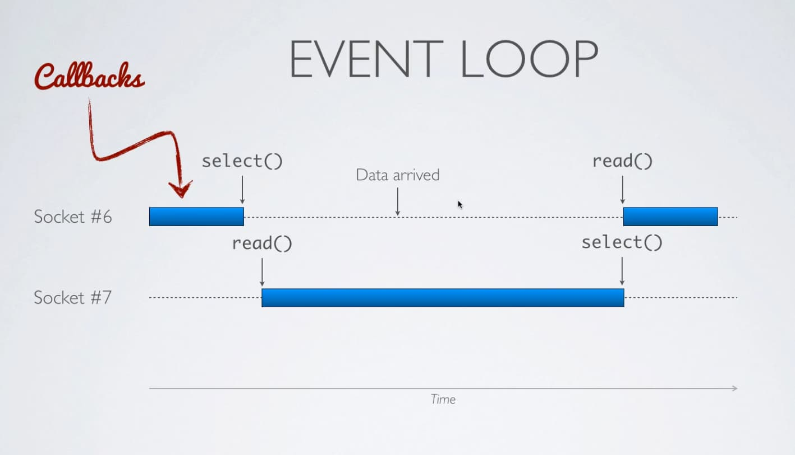

# Notes


Node is the Javascript V8 engine (runtime) coupled with libUV high performance event loop library.
 

# Event Loops
- Node uses `libuv`
- Deno `tokio`
- Ruby `EventMachine (c++)`
- Python `twisted`


### Part 1: IO
The two types of code you'll write is either:
- CPU: a piece of code that is blocking because of how long it takes to compute something.
- IO:  
  - reading or writing from the disk, it not may be CPU intensive but it takes long.
  - network operation like connecting to a server or waiting for a resposne
  - connected to a DB (POSTgres...connected via socket). You may be limited by IO speed of your OS, but also network latency.


### What are the trade offs of using an IO event library in Node
No code runs concurrently, it just 1 piece of code running/executing at ANY GIVEN time.
The IO operations, specifically the waiting will run concurrently, but thats the only part that runs concurrently.


# Sync/Asynchronous IO 

```js
//********SYNCHRONOUS*************
var content = io.read();
//waiting.....blocked
console.log(content);

 
//********ASYNCHRONOUS*************
io.read((content) => {
  console.log(content)// called only when ready
})
// returns right away....we're  here...
//This is how we achieve concurrency in node as a single threaded language. IO bound operations we pass off
//we continue running through our program getting other stuff done....we're working in a concurrent fashion.
```


# Evented IO
What we mean by evented IO in Node (or any system that uses an event loop for IO) is that when
the code async code we write is ready, an event is emitted. But how do we know when the event
happens? Our operating systems kernal notifies us.


```js
io.read(whenIOready(content) => {
  console.log(content)// called only when ready
})  
```


# IO Basics (in Unix-like OS's)
 What is an IO object on unix like systems: anything you can read or write to:

 ```js
//
 let data = file.read();
 file.write("data);

 // read/write from a socket
 let data = socket.read()
 socket.write("data")
 ``` 

 Most of the time you're not going to see the read/write operations in the library
 that you use. For example, when you're sending a query to a database, whats happening
 in the background is a `read`/`write` operation is happening on a socket. For a query
 you're going to `write` to a socket that's connected to your database. When you get
 the results you're going to `read` off the socket.

Whether the database is on your machine or another machine, you're going to be connected
via a socket.
 ```js
 var results = db.execute("SELECT * FROM Users");
 ```

IO events are happening all the time in our applications. But how do we identify those
IO objects: file descriptors (you may hear it called socket descriptor)

Each time you open a file or are connected to a remote server that socket
or file will be assigned a unique number to your process. By default,
every unix proceess that you start, anytime you run a command, anytime you start
an application you're going to be assigned 3 file descriptors.
 
```
0 stdin  1 stdout   2 stderr  ...3 file_etc?    4 socket_etc?
```

**TODO: a visualition of seeing the table get updated would be nice**
If in our program we open a file, the FD table (every proccess hasone)
is going to be updated. So 3 will get added, 4 for a socket...it goes up.

If we close a file or socket, that number be freed up, that is the number
will still be on the table, but it's associated value will be freed.

It's important to close files or sockets when youre done with them so you
free up space in the FD table.

How do we get a file descriptor? Using the API's of our operating system that is
using syscalls. When we make syscalls we hand control of our program to the OS.


```
   node / ruby / python
         |
         C
         |
   syscalls (c functions): interact with OS/kernal on our system...some are implemented in C or assembly
          |
   operating system
```

Why is it important to know about syscalls? Because if you move languages, its
still going to be based on the same sys calls. For the past 30-40 years, since unix, **TODO*
unix systems have all shared these common syscalls. There's a standard...
**TODO: insert image of how this is applied across popular programming languages (logos)**

Syscalls are friendly API's for developers to interact with the OS kernal.
If you want to read/open/write to a file, open a socket, we use syscalls that we use.
There are no other lower level functions or ways to open a file on unix systems 
unless you use `open` syscall. Open a socket, then use `socket` syscall.

You often won't see these functions because they're abstracted from you.


### Documentation

```
man 2 socket
```
Section 2 is for the supported syscalls supported by our computer's kernal.
Section 1 is common command line utilitles.


Even though we're using JS, our syscalls will follow the API documentation very closely.
**TODO: make a point about how python's API is close to C...Oz networking...**


### What is the `syscalls` library?
We're going to be using syscalls from node, but syscalls are not accessible
by default. So Marc created the `syscalls` module written in C++ to expose the system calls
in NodeJS. So when you see `syscalls.write` this is not a standard builtin node API.
**Don't use these in prod.**

`syscalls` library was written to resemble the actual C syscalls, so the syscalls
docs should be easy to follow.

```js
const syscalls = require('syscalls');
syscalls.write(fd, 'yo')
```
 s
```c
#include <unistdh.h>
int main(int argc, char const *argv[]) {
  write(fd, 'yo')
  return 0;
}
```


# Exercise time
1. Create a module called io.js to get familiar with syscalls


# Sockets & Server
There's no difference with read/writing from a socket and file. They use the same syscalls. This is why people say (everything is a file).

### What are sockets
A way for you to connect to a different machine or also a way to communicate across proccesses.

```
Client        Accepting
Socket  ----   Socket
173.x           18.xx:PORT
```


What your seeing is the absolute basics and core essentials of any unix server. 
All the servers you use on the web are all based on those 4 syscalls: socket, bind, listen, accept


# Non-blocking
Now that we're familiar with IO in a synchronous style, we're going to learn about non-blocking IO, which
is the core of the node's event loop.  All system calls that play with the IO object are blocking.

See `examples/` folder.

IO Multiplexing backends
- `select` ... simplest and most mortable, but the slowest one out of them all. `epoll` is fast used on linux (nginx)
- `poll`
- `epoll` linux
- `kqueue` (BSD, MacOSX)

Event loop code typically have lots of code because of the multiple sync multiplexing are diff.


# The point of Select
Gives us lightweight concurrency (multi-tasking) without using threads etc.


# Building a Chat Server
Why are we buiilding a chat server?
- build a server that handles multiple connections at once
- build a server that can broadcast messages to ALL connected clients (*guess...we'll need to create a pool of connected clients)
- opportunity to use select on reads, writes


# Day 2
- **Refactor chat server**
  - extract some code out and move it into a new module called event loop
- 
**Create our async IO event loop library we can import in our server's code**
  - add support for write support for event loop
  - add 2 extra features to event loop library that usually come with real event loop libraries.
    - implement timers, think `setTimeout`)
    - implement `nextTick`

- **Create a concurrent web server**
  - create parser and other relevenat parts,

- **Blocking/unblocking event loop**
  - See how we can block the event loop and unblock it for learning purposes

- Proccesses:
  - not directly related to the event loop, but processes can help us run our event loop on multiple cores.
  - By default nodejs runs in 1core/1process, we want to take advantage of multiple proccesses.


### Reactor Design Pattern
Used in event loop libraries.
React to some `read/write/error..etc` events & execute a callback.

```
        Events
REACTOR /
        \
        Callbacks
```

Example of pattern in use from real code from browser and server land.

```js
// UI
$(`#button`).click(() => {/**/})


//server
http.createServer(function handleRequest(request, response)=> {
  response.writeHead(200, {`Content-Type`: `text/plain`})
  response.end(`Hello World\n`);
})
.listen(1337, `127.0.0.1`);
```


# Adding Timers to Our Event loop
After finishing `event-loop-v1` and using it in `chat-server-v3.js` we're now going to add another feature to our event loop.
So far we've added the most common features of an event loop: 
- registering/removing events.

But event loop libraries do much more than being able to watch file descriptors, most event loop libraries support timers.
In native javascript you can declare timers this way:

```js
setTimeout(() => {
  console.log(`I'll print 1 sec later`);
}, 1000)
```

We're actually going to implement this functionality in our event loop-library.
How? At each turn in the event loop, we will check if there are any timers due, if so we'll a callback.


# Reasons why timers are not 100% accurate:
This problem is occurs in every event library system.
```js
/**
 * Starts the event loop explicitly as we are using our own event loop & not the one from Node.
 * 
 * What do you mean by the statement above? 
 *  If we we're using the built in modules/functions (API's) that are part of node, they abstract from us the event loop.
 * @returns {void}
 * @example
 * event_loop.run();
 */
function run(){
  while (true) {
    const fds = syscalls.select(Object.keys(callbacks.read), Object.keys(callbacks.write), []);
    const readable_fds = fds[0];
    const writable_fds = fds[1];
  
    readable_fds.forEach((fd) => {
      const callback = callbacks[fd];
      callback(); 
    });
    writeable_fds.forEach((fd) => {
      const callback = callbacks[fd];
      callback();
    });

    const time = new Date().getTime();
    
    // ❗❗❗❗ If a callback above takes 5s, 1m, etc of time to execute our timer will of course be delayed.
    [...timers].forEach((timer) => {
      if(time >= timer.timeout) { // is the timer due or overdue
        timer.callback();
        timers.splice(timers.indexOf(timer), 1); // since these are not interval timers, remove them once used.
      }
    })
  }
}
```


# Web server
Web server (if your using HTTP protocol its an HTTP server, you might have a DNS server or something else)

```
CLIENT <----------PROTOCOL------------> SERVER
```

Layers of a webserver typically (email server, chat server etc)

```
REQUEST PARSER: parse the incoming data (bytes of data) that's coming to us. Parse it, transform it to an object that we as programmers can extract meaning from it.
    |
SCHEDULER: distribute the work between the load of all connections. In our case, its the event loop, which is in charge of managing the connections.
    |
Connection(s)
    |
Response Encoder: Write back to the socket.
```


# If we used threads along the event loop would we get better perf? (No, overhead of context switching)
usually no because when you have lots of threads (....1 per connection), the thread scheduler needs to switch context
AKA save all the local variables about the current context........not super expensive but if we have lots of connections
there's a lot of context switching........its like in real life if we're switching contexts too much not very effective.


For python, ruby and other languages which have a **global interpreter lock prevents 2 threads from running exactly at the same time**
there is no parallism.


###  When would we introduce threads
If you have large chunks of code in some callbacks, it would allow those callbacks to be split ...spread execution time more evenly...


### Thread servers
#### Thread Preemptive (recall that this is to prevent from 1 thread from hogging the system.)
The interpreter/your language can interrupt a task at any time without the task knowing its being interruped.
If you've threads you know the code in the thread can be paused/resumed at any time and you don't need to do that at any time. 
We have no control over our thread switches, the thread scheduler manages that. Premptive threading!


This is how thread based servers would handle 2 concurrent 2 connections. Most thread schedulers work like this (ex: ruby/python).
They will only run 1 piece of code at a time b/c of the **global interpreter lock (only allows 1 thread to execute at a time)**.

Quantum refers to the time slicing interval that we give to each of those threads. Languages have different time slices.
So we might run for 10ms and then switch halfway and go to socket 7 and then back to 6.


Lets say once we get back to socket 6 we go a `read` call in the middle of the alloted time...we're just going to wait for the data to arrive
in the remaining time....lets say it doesnt arrive, we switch to socket 7, go back to socket 6....still waiting for data....go back to 7....
then go back to 6 later. The data could have arrived in socket 7's time slice, but we had to wait for the thread scheduler to
schedule us back on.


This is the problem with IO operations with threads in most languages. This is how a thread server works (Apache)

  


### Event Loop Servers
With evented IO servers we block the event loop by having callbacks that take too much time



### Scaling your node application to run across multiple processors (parallelism sort of)
- Spawn a new instance of Node per CPU (that means 4 event loops)
Oveview of proccessess in Unix systems...

```
> node server.js

> ps 
  PID tty         TIME      CMD
  101 ttys001     0:00.06   node server.js
```

Basic production setup (Ex: start 3 servers on 3 diff ports)
and put Put ngxin infront of these servers to load balance

```
node http_server.js --port 3000 &
node http_server.js --port 3001 &
node http_server.js --port 3002 &
```


# Load balancing at the operating system level using `fork` syscall.
creates a copy of a process, which creates a child proccess (still spreading across CPU's)

We're going to transform our `http_server` to a pre-fork server....its called this because it forks before a new connection.
Forking a process is time consuming...do it at the beginning!

```
               fork() - WORKER (1 node process w/event loop)
listen() --->  fork() - WORKER (1 node process w/event loop)
 MASTER        fork() - WORKER (1 node process w/event loop)
```

The only thing that's shared between parent & child...is the file descriptior. Child has the same FD as parent.
If i open a file before calling `fork` and then fork, the child processes share the same file descriptor.


# Last exercise (eval server)
implement a server that will accept connections `read,fork,eval(read_bytes)` in the child process and back the result
in the client


# resources
learnboost.github.com/cluser -- cli tool for prefork server without any modifying code 
nodejs.org/api/cluster.html -- Node js cluster is for managing a bunch of proccesses in node.
Cluster module is a great `pre-fork` tool.